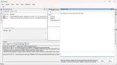
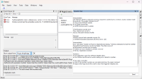
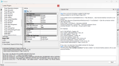

# Plugin.McpBridge

A plugin for the SAL host application that connects an AI assistant to the SAL host using [Microsoft Agent Framework](https://github.com/microsoft/agent-framework) and native AI function calling.

[](.github/assets/UI-1.png)
[](.github/assets/UI-2.png)
[](.github/assets/UI-3.png)

## Overview

Plugin.McpBridge is a SAL plugin that gives an AI assistant live access to every plugin loaded in the SAL host.
`Microsoft.Agents.AI` (backed by `Azure.AI.OpenAI` / `Microsoft.Extensions.AI`) powers the assistant, which uses registered AI tools to inspect and automate loaded SAL plugins — all driven from an interactive chat panel docked inside the SAL host window.

```
User ──► PanelChat ──► AssistantAgent (Microsoft.Agents.AI)
                              │
                    ┌─────────▼─────────────────────────────┐
                    │  ChatClientAgent + AgentSession       │
                    │  ┌──────────────────────────────────┐ │
                    │  │  AI tools (function calling)     │ │
                    │  │  - SettingsList                  │ │
                    │  │  - SettingsGet                   │ │
                    │  │  - SettingsSet  ← confirmation   │ │
                    │  │  - MethodsList                   │ │
                    │  │  - MethodsInvoke ← confirmation  │ │
                    |  |  - SystemInformation             | |
                    │  └──────────────────────────────-─-─┘ │
                    └───────────────────────────────────────┘
```

## Features

- **Native AI function calling** — the assistant invokes plugin tools directly through the model’s function-calling API; no custom text-parsing commands.
- **SAL plugin exposure** — every loaded SAL plugin is automatically discoverable by the assistant.
- **Plugin settings automation** — the assistant can list, read, and write settings of any loaded plugin on behalf of the user.
- **Plugin method invocation** — the assistant can enumerate and invoke methods exposed by any loaded SAL plugin.
- **User-confirmation gate** — any action that mutates state (`SettingsSet`, `MethodsInvoke`) requires explicit user approval via an inline confirmation strip in the chat panel before execution. Oversized tool results also prompt a second confirmation before truncation.
- **Persistent session** — `AgentSession` maintains the full conversation context across turns without a manual loop or iteration cap.
- **WinForms chat panel** — a dockable chat panel accessible from *Tools → OpenAI Chat*.
- **Multiple AI providers** — OpenAI, Azure OpenAI, and any OpenAI-compatible endpoint (Qwen, Grok, Gemini, custom).
- **Reasoning model support** — optional `ReasoningOutput` and `ReasoningEffort` controls for models that expose chain-of-thought steps.

## Supported AI Providers

| `ProviderType` value | Description |
|---|---|
| `OpenAI` | OpenAI public API |
| `AzureOpenAI` | Azure OpenAI Service |
| `OpenAICompatible` | Third-party OpenAI-compatible API with a custom endpoint |
| `LocalOpenAICompatible` | Local model server (no API key required) |
| `QwenCompatible` | Alibaba Qwen API |
| `GrokCompatible` | xAI Grok API |
| `GeminiCompatible` | Google Gemini via OpenAI-compatible endpoint |
| `CustomCompatible` | Any other custom endpoint |

## Configuration

Settings are managed through the standard SAL plugin settings mechanism (right-click the plugin in the SAL Plugin Manager).

| Setting | Default | Description |
|---|---|---|
| `ProviderType` | `OpenAI` | Selects the AI provider profile. |
| `ModelId` | `gpt-4o-mini` | Model identifier or Azure deployment name. |
| `ApiKey` | *(none)* | API key for the selected provider. Not required for `LocalOpenAICompatible`. |
| `ModelEndpointUrl` | *(none)* | Custom base URL for OpenAI-compatible providers. Required for Azure OpenAI. |
| `DeploymentName` | *(none)* | Azure OpenAI deployment name, or organization identifier for OpenAI-compatible providers. |
| `AssistantSystemPrompt` | *(see below)* | System-level instruction injected at the start of every chat session. |
| `Temperature` | *(provider default)* | Sampling temperature (0.0 – 2.0). |
| `MaxTokens` | *(provider default)* | Maximum completion tokens per request. |
| `MaxToolResultLength` | `8000` | Maximum characters of a single tool result forwarded to the model. If a result exceeds this limit the user is asked to confirm sending a truncated version. |
| `ReasoningOutput` | *(none)* | When set, includes the model’s reasoning trace in the response. Useful for debugging. |
| `ReasoningEffort` | *(none)* | Controls how much effort the model spends on chain-of-thought reasoning (`Low`, `Medium`, `High`). |
| `ConnectionTimeout` | `100` | Request timeout in seconds. |
| `ToolsPermission` | `RequireConfirmation` | Controls when the assistant can use tools: `AlwaysAllow`, `RequireConfirmation`, `AlwaysDeny`. |

**Default system prompt:**
> *You are a SAL automation assistant.
Use available MCP tools when useful.
Return clear user-facing responses, or a command payload only when automation is required.
Before using relative dates (today, yesterday, last hour), obtain the current system time from the host environment..*

## AI Tools

The assistant interacts with SAL plugins through five AI tools registered via `AIFunctionFactory.Create()`. The model invokes them directly through the API’s function-calling mechanism — no custom text parsing.

| Tool | Description |
|---|---|
| `SettingsList` | List all settings exposed by a plugin. |
| `SettingsGet` | Read the current value of a specific setting. |
| `SettingsSet` | Update a setting value ← requires user confirmation |
| `MethodsList` | List all callable methods exposed by a plugin. |
| `MethodsInvoke` | Invoke a plugin method ← requires user confirmation |
| `SystemInformation` | Used to clarify OS, DateTime format and UTC |

Any tool that mutates state (`SettingsSet`, `MethodsInvoke`) is held until the user approves or denies it via the inline confirmation strip. If the result of a `MethodsInvoke` call exceeds `MaxToolResultLength` characters, a second confirmation is shown before sending a truncated version to the model.

## Architecture

| Class | Responsibility |
|---|---|
| `Plugin` | SAL entry point; registers the *Tools → OpenAI Chat* menu item and owns the component lifecycle. |
| `AssistantAgent` | Builds the `ChatClientAgent` (Microsoft.Agents.AI), manages the `AgentSession`, and exposes AI tool functions via `AIFunctionFactory`. |
| `PanelChat` | WinForms `UserControl` — the dockable chat UI including the inline user-confirmation strip. |
| `PluginSettingsHelper` | Reflection-based helper to enumerate, read, and write settings on any loaded SAL plugin. |
| `PluginMethodsHelper` | Reflection-based helper to enumerate and invoke methods on any loaded SAL plugin. |
| `Settings` | Strongly-typed, `INotifyPropertyChanged` settings bag persisted by the SAL settings infrastructure. |

## Installation

1. Download the release archive (.zip or .nupkg).
2. Place the plugin assembly into the host application plugin directory (SAL / host supporting Windows environment):
	- [Flatbed.Dialog](https://dkorablin.github.io/Flatbed-Dialog/)
	- [Flatbed.Dialog (Lite)](https://dkorablin.github.io/Flatbed-Dialog-Lite)
	- [Flatbed.MDI](https://dkorablin.github.io/Flatbed-MDI)
	- [Flatbed.MDI (WPF)](https://dkorablin.github.io/Flatbed-MDI-Avalon)
	- [Flatbed.MDI (AvaloniaUI)](https://dkorablin.github.io/Flatbed-MDI-AvaloniaUI)
3. Restart the host application; Plugin.McpBridge should appear in the plugin list (Tools -> OpenAI Chat).