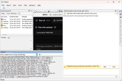
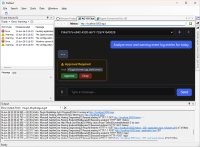
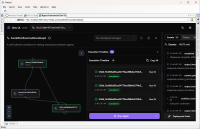

# Plugin.McpBridge

A SAL plugin that connects an AI assistant to the host application using [Microsoft.Agents.AI](https://github.com/microsoft/agent-framework) and native function calling.

[](.github/assets/UI-1.png)
[](.github/assets/UI-2.png)
[](.github/assets/UI-3.png)

## Overview

Plugin.McpBridge gives an AI assistant live access to loaded SAL plugins, their settings, and their callable methods from an interactive WinForms chat panel docked inside the host window.

The core agent uses `Microsoft.Agents.AI` with `Azure.AI.OpenAI` and `Microsoft.Extensions.AI` backends. It can also expose the same tool set over MCP so the optional DevUI and AG-UI web hosts can connect to the bridge from outside the desktop process.

Per-agent configuration now goes beyond provider selection: each agent can have its own system prompt, skills directory, RAG knowledge base, tool/plugin permissions, and selected provider profile.

```
User -> PanelChat -> AssistantAgent (Microsoft.Agents.AI)
          |
          +-> AgentSession (persistent chat state)
          |
          +-> Tools
            - SettingsList / SettingsGet / SettingsSet
            - MethodsList / MethodsInvoke
            - SystemInformation
            - WindowsGet / WindowClose (when IHostWindows is available)
            - MCP bridge tools
          |
          +-> Optional context providers
            - SkillsDirectory
            - RAG knowledge base
            - Workflows loaded from JSON
          |
          +-> MCP server (http://localhost:5050)
            +-> DevUI (http://localhost:5051)
            +-> AG-UI (http://localhost:5052)
```

## Features

- Native AI function calling through `Microsoft.Agents.AI`; no custom text parsing layer.
- Multiple AI agent profiles in one plugin, each with its own provider, prompt, permissions, skills directory, and optional RAG knowledge base.
- Runtime agent and provider switching from the chat panel Send dropdown.
- Automatic discovery of loaded SAL plugins, their settings, and their callable methods.
- Setting updates and plugin method invocations require explicit user approval before execution.
- Persistent chat sessions in the WinForms panel, plus a New Conversation button to reset history.
- Image and file paste support in the chat input with `Ctrl+V`.
- Markdown rendering for assistant responses, including headings, formatting, code blocks, lists, and embedded images.
- Host window tools (`WindowsGet` and `WindowClose`) when the SAL host implements `IHostWindows`.
- Permission allowlists for both tool usage and plugin access.
- Embedded MCP server over HTTP/SSE JSON-RPC 2.0 for external MCP clients.
- Optional DevUI diagnostics host launched as a child process.
- Optional AG-UI host launched as a child process with optional session persistence.
- Workflow loading from a configured directory of JSON files, using Microsoft.Agents.AI.Workflows.
- GitHub Copilot CLI provider support through `gh copilot`.
- Stub provider for offline UI testing.

## Supported AI Providers

| `ProviderType` value | Provider class | Notes |
|---|---|---|
| `OpenAI` | `NetworkProviderDto` | OpenAI public API or any OpenAI-compatible endpoint. |
| `AzureOpenAI` | `AzureProviderDto` | Azure OpenAI Service. |
| `CoPilot` | `CoPilotProviderDto` | GitHub Copilot CLI (`gh copilot`). |
| `Local` | `NetworkProviderDto` | Local OpenAI-compatible server; no API key required. |
| `Stub` | `StubProviderDto` | Scripted local responses for UI testing. |

## Configuration

Settings are managed through the standard SAL plugin settings UI. Most values are exposed in the property grid with rich editors and dropdowns.

### Agent Settings

Each entry in `AiAgents` is an `AiAgentDto` record. The chat panel can switch between agents at runtime.

| Setting | Default | Description |
|---|---|---|
| `SelectedAgentId` | *(first agent)* | Active agent profile. |
| `AssistantSystemPrompt` | *(see below)* | System prompt injected into the agent session. |
| `SkillsDirectory` | *(none)* | Optional directory of skills files that the agent can read and write. |
| `RagToolName` | *(none)* | Name of the generated RAG search tool. |
| `RagToolDescription` | *(none)* | Description for the RAG search tool. |
| `RagDirectory` | *(none)* | Optional knowledge base directory. Supports `.txt` and `.md` files. |
| `RagCitationsPrompt` | *(none)* | Optional citation guidance appended to RAG responses. |
| `ToolsPermission` | *(all allowed)* | Allowlist of tool method names the agent may use. |
| `PluginsPermission` | *(all allowed)* | Allowlist of plugin IDs the agent may use. |

### Global Settings

| Setting | Default | Description |
|---|---|---|
| `AiProviders` | *(empty list)* | Provider profiles available to all agents. |
| `AiAgents` | *(one default agent)* | Collection of agent profiles. |
| `WorkflowsDirectory` | *(none)* | Optional directory of workflow JSON definitions loaded at runtime. |
| `McpServerEnabled` | `false` | Starts the embedded MCP server. Automatically enabled when DevUI or AG-UI is enabled. |
| `McpServerUrl` | `http://localhost:5050` | URL used by the MCP server. |
| `DevUIEnabled` | `false` | Starts the DevUI child process for diagnostics. Requires the DevUI executable beside the plugin assembly. |
| `DevUIServerUrl` | `http://localhost:5051` | URL used by DevUI. |
| `AgUIEnabled` | `false` | Starts the AG-UI child process for web-hosted interaction. Requires the AG-UI executable beside the plugin assembly. |
| `AgUIServerUrl` | `http://localhost:5052` | URL used by AG-UI. |
| `AgUISessionStorageDirectory` | *(none)* | Optional directory for persistent AG-UI session storage. |

### Provider Settings

Each provider entry can expose different fields depending on its concrete type.

#### Common provider fields (`AiProviderDto`)

| Setting | Default | Description |
|---|---|---|
| `ProviderType` | `OpenAI` | Provider family used to instantiate the client. |
| `ModelId` | *(none)* | Chat model or deployment name. |
| `ModelEndpointUrl` | *(none)* | Optional absolute endpoint URL. Required for Azure OpenAI and many compatible providers. |
| `Temperature` | *(provider default)* | Sampling temperature. |
| `MaxTokens` | *(provider default)* | Maximum completion tokens per request. |
| `ReasoningOutput` | *(none)* | Optional reasoning trace output. |
| `ReasoningEffort` | *(none)* | Optional reasoning effort level. |

#### Network provider fields (`NetworkProviderDto`)

| Setting | Default | Description |
|---|---|---|
| `ApiKey` | *(none)* | API key for network-based providers. Not required for `Local`. |
| `ConnectionTimeout` | `100s` | Request timeout for the provider connection. |
| `EmbeddingModelId` | *(none)* | Embedding model used for RAG. |
| `EmbeddingModelDimention` | *(inferred when possible)* | Embedding vector size used by the RAG store. |

#### Azure provider fields (`AzureProviderDto`)

| Setting | Default | Description |
|---|---|---|
| `ApiKey` | *(none)* | Azure OpenAI API key. |
| `DeploymentName` | *(none)* | Azure OpenAI deployment name. |

#### GitHub Copilot CLI fields (`CoPilotProviderDto`)

| Setting | Default | Description |
|---|---|---|
| `CoPilotPath` | *(auto-detect)* | Absolute path to the `gh copilot` CLI executable. |
| `GitHubToken` | *(auto-detect)* | GitHub token used by the Copilot CLI. |

**Default system prompt:**

> You are a SAL automation assistant.
> Use available MCP tools when useful.
> Return clear user-facing responses, or a command payload only when automation is required.
> Before using relative dates (today, yesterday, last hour), obtain the current system time from the SystemInformation tool.

## AI Tools

The assistant interacts with SAL plugins and the host through `AIFunction` tools registered by the bridge.

| Tool | Class | Description |
|---|---|---|
| `SettingsList` | `PluginSettingsTools` | List all settings exposed by a plugin. |
| `SettingsGet` | `PluginSettingsTools` | Read the current value of a specific setting. |
| `SettingsSet` | `PluginSettingsTools` | Update a setting value; requires user confirmation. |
| `MethodsList` | `PluginMethodsTools` | List all callable methods exposed by a plugin. |
| `MethodsInvoke` | `PluginMethodsTools` | Invoke a plugin method; requires user confirmation. |
| `SystemInformation` | `ShellTools` | Returns OS version, current date/time, and UTC offset. |
| `WindowsGet` | `WindowsTools` | List open windows and their captions. Requires `IHostWindows`. |
| `WindowClose` | `WindowsTools` | Close a window by caption; requires user confirmation and `IHostWindows`. |

Tool descriptions for plugin methods are enriched from XML documentation comments when available. Any tool that mutates state stays behind the inline confirmation bar until the user approves it.

## Architecture

### Core plugin

| Class | Responsibility |
|---|---|
| `Plugin` | SAL entry point; registers the `Tools -> OpenAI Chat` menu item and manages the agent, MCP server, and child-process hosts. |
| `AssistantAgent` | Multi-turn agent orchestrator that streams responses and raises confirmation events. |
| `AgentFactory` | Builds agents from any supported provider, attaches tools, and wires skills, RAG, and workflows. |
| `AgentHandle` | Lifetime container for the built agent and underlying client. |
| `PanelChat` | Dockable WinForms chat UI with agent/provider switching, attachments, streaming markdown, and confirmations. |
| `Settings` | Persisted settings bag for providers, agents, permissions, MCP, DevUI, AG-UI, and workflow configuration. |

### Tools and discovery

| Class | Responsibility |
|---|---|
| `ToolsFactory` | Builds the `AIFunction[]` tool set and applies permission filters. |
| `PluginSettingsTools` | Reflection-based read/write access to SAL plugin settings. |
| `PluginMethodsTools` | Lists and invokes callable plugin methods. |
| `PluginMethodsToolsExtractor` | Discovers callable plugin methods and applies XML doc metadata. |
| `ShellTools` | Exposes host/system information. |
| `WindowsTools` | Exposes host window inspection and closing when supported. |

### MCP bridge

| Class | Responsibility |
|---|---|
| `McpServer` | Exposes the in-process tool set over HTTP/SSE JSON-RPC 2.0. |
| `McpClient` | Connects to a remote MCP server and maps remote tools back into `AIFunction` objects. |
| `McpSession` | Manages one SSE connection and correlates JSON-RPC responses. |

### Out-of-process hosts

| Class | Responsibility |
|---|---|
| `ProcessHost` | Launches DevUI or AG-UI as a child process and stops it when the host exits. |
| `SettingsDto` | Serializable config passed to the child process at startup. |

### UI components

| Class | Responsibility |
|---|---|
| `MarkdownTextBox` | Renders assistant responses with markdown formatting and embedded images. |
| `AttachmentsPanel` | Manages pasted attachments in the chat UI. |
| `ConfirmationPanel` | Inline approval bar for state-changing tool calls. |
| `ToolsPermissionEditor` | Checkbox editor for tool allowlists. |
| `PluginsPermissionEditor` | Checkbox editor for plugin allowlists. |

### Data and DTOs

| Class | Responsibility |
|---|---|
| `AiAgentDto` | Per-agent configuration, including prompt, permissions, skills, and RAG settings. |
| `AiProviderDto` | Base provider settings. |
| `NetworkProviderDto` | Network provider settings plus timeouts and embeddings. |
| `AzureProviderDto` | Azure OpenAI-specific settings. |
| `CoPilotProviderDto` | GitHub Copilot CLI settings. |
| `StubProviderDto` | Read-only stub provider for local testing. |

### Workflow loading

`WorkflowsDirectory` can point to a folder of JSON workflow definitions. At runtime the bridge can load sequential, concurrent, group-chat, handoff, magentic, and conditional graph workflows through `Microsoft.Agents.AI.Workflows`.

### AG-UI project (`Plugin.McpBridge.AgUI`)

The AG-UI project is an ASP.NET Core host launched as a child process. It connects to the embedded MCP server, builds an agent from the selected agent profile, loads any workflows from `WorkflowsDirectory`, and serves the web UI at `/agui`.

### DevUI project (`Plugin.McpBridge.DevUI`)

The DevUI project is a separate ASP.NET Core host for diagnostics. It is launched as a child process and uses the same bridge settings and MCP-backed tool set.

## Installation

1. Build the solution for `net8.0-windows` or use a release package.
2. Copy `Plugin.McpBridge.dll` into the host application's plugin directory.
3. Copy `Plugin.McpBridge.DevUI.exe` and `Plugin.McpBridge.AgUI.exe` beside the plugin assembly if you want DevUI or AG-UI to launch.
4. Choose one of the following host applications to run this plugin:
  - [Flatbed.Dialog (Lite)](https://dkorablin.github.io/Flatbed-Dialog-Lite)
  - [Flatbed.MDI](https://dkorablin.github.io/Flatbed-MDI)
  - [Flatbed.MDI (WPF)](https://dkorablin.github.io/Flatbed-MDI-Avalon)
  - [Flatbed.MDI (AvaloniaUI)](https://dkorablin.github.io/Flatbed-MDI-AvaloniaUI)
5. Configure agents, providers, permissions, and optional RAG or workflow folders from the SAL [plugin settings UI](https://github.com/DKorablin/Plugin.Configuration).
6. Plugin.McpBridge should appear in the plugin list (*Tools → OpenAI Chat*).

## Notes

- `McpServerEnabled` is automatically treated as enabled when DevUI or AG-UI is enabled.
- The default MCP/DevUI/AG-UI URLs are `http://localhost:5050`, `http://localhost:5051`, and `http://localhost:5052`.
- RAG knowledge bases currently support `.txt` and `.md` files.